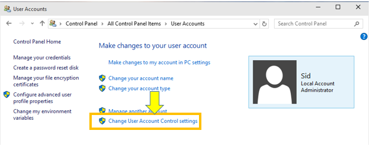
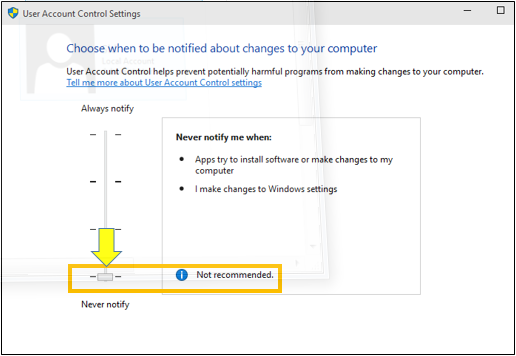

**************************
Environment Setup  
**************************

Disable UAC (User Access Control) in Client Side
================================================

**User Account Control (UAC)** is a security protocol which was introduced in Windows Vista. UAC limits the administrative privileges to only those applications which are trusted by the user, and any applications or process which does not inherit administrative privileges will have to be authorized even if the user running it has administrator account. UAC will prompt you via a pop up message when an application or process tries to make a change to the system. You can then allow or deny the access in the UAC prompt.

As a uDCV user, you may not want these UAC prompts and can disable them by following the below mentioned steps.

1. Open the Control Panel (icons view) and select User Accounts.
2. Click on the Change User Account Control settings link.

4. If prompted by UAC, click on Yes to continue.
5. In the User Account Control settings, move the slider to the bottom (Never Notify).

7. If prompted by UAC, click on Yes to continue.

Adjust video card settings 
===========================
Adjust video card settings to maximum performance, please refer to video card manual for details.