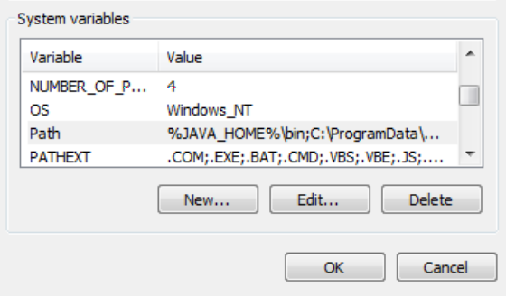

*********************
Install and Running
*********************

Install JDK 1.7.0_x
====================
Check the JAVA runtime version on client PC, it **must** show version 1.7.0_x, as shown below:

.. note::
    If you don’t have the correct JAVA version, please install it from http://www.oracle.com/technetwork/java/javase/downloads/jdk7-downloads-1880260.html  Ask your representatives
    for assistance, if needed. 

Setup Environment Variables
================================

Set JAVA_HOME 
^^^^^^^^^^^^^^
1. Create a new environment variable name ``JAVA_HOME`` if not exists.
2. Set the value of ``JAVA_HOME`` to the folder where JDK 1.7.0_x is installed.

Add Java Executable to System Path
^^^^^^^^^^^^^^^^^^^^^^^^^^^^^^^^^^^
Add Java executable folder ``%JAVA_HOME%\bin`` to system path.

Unzip uDCV Tarball
====================

Unzip the folders to local drive, e.g. ``C:\``, There are three folders in the tarball:

1. uDCV_BIN (Server)
2. uDCV_DATA (Demo data)
3. uDCV_UTIL (Utility file)
   

Start uDCV Server
==================
1. Login as **Administrator**
2. Open windows command line window and cd to ``{uDCV_BIN}/bin`` folder
3. Run startup.bat 

4. Wait until uDCV server has started in a pop up window, it shall shows ``INFO: Server
startup in xxxxx ms``

.. note::
   uDCV server must be run as **Administrator**

5. Enter this URL in IE to access the uDCV: http://localhost:8080/dcv_jupiter1

.. note::
   Before use uDCV, user need to :ref:`apply license <license-label>`
